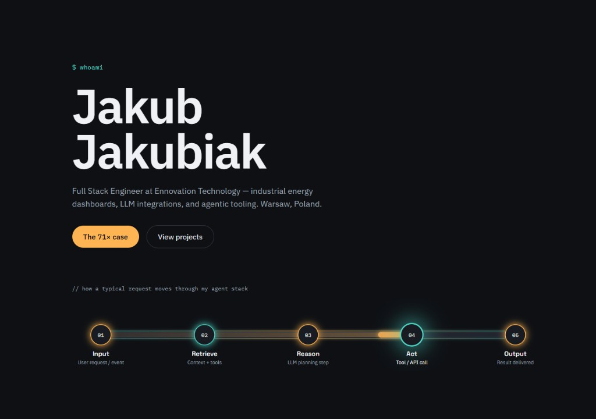

# Portfolio

Personal portfolio of **Jakub Jakubiak** — Full Stack Engineer building industrial energy dashboards, LLM integrations, and agentic tooling.

Live: [jakubjakubiak.com](https://jakubjakubiak.com/)



Public-safe case notes (no IPs, clients, or wiring): [`docs/ems/`](docs/ems/).

## Stack

- React + Vite
- Tailwind CSS v4
- Framer Motion

## Development

```bash
npm install
npm run dev
```

## Build

```bash
npm run build
npm run preview
```
