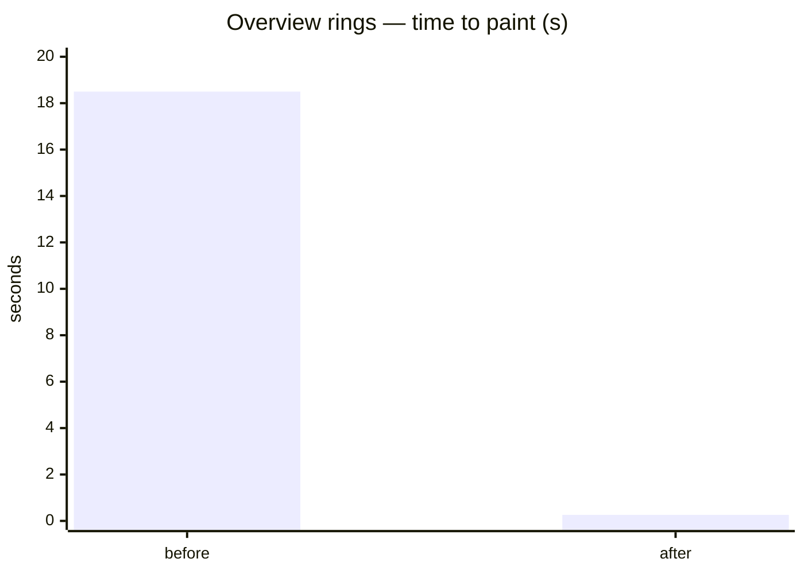

# Overview performance — 19 s to 0.26 s

The case that belongs on the portfolio. Numbers measured on production (browser QA), not guessed. No site names, no IDs, no API paths.

## What the operator saw

On a real installation the overview **rings** (production / consumption totals) took **about 19 seconds** to paint. The page was not empty of meaning — the numbers were right — it just felt broken.

On another path, **line charts** with no points in the window kept a loading skeleton for **35 seconds**, even though the empty answer had already come back in well under a second.

After the fix, the same rings paint in **~0.26 s**. Empty lines finish with the response, **~0.6 s**.

## Measured

`skrócenie %` = (before − after) / before × 100.  
`×` = before / after.  
Ring UX used the mid of 18–19 s → **18.5 s**. Totals query after the fix: 214–304 ms → **260 ms**.

| What the user sees | Before | After | Cut | Faster |
|--------------------|--------|-------|-----|--------|
| Overview rings — time to paint | ~18.5 s | ~0.26 s | **~99%** | **~71×** |
| Line skeleton when the series is empty | 35 s | ~0.6 s | **~98%** | **~58×** |
| Totals query in the time-series store (one side) | ~3 s (then timeout) | ~0.26 s | **~91%** | **~12×** |

Happy-path line canvas with data already sat around **~3 s** — that was never the 19 s problem. The 19 s was rings. The 35 s was empty lines.

Linear bars hide the “after” sliver. On a slide, use **log scale** or two panels (seconds vs milliseconds).

## Why rings took ~19 s

Not “missing tags”. The store had the series. The **fast totals path failed**.

The query was too heavy for the health window (aggregation + timezone on a large range). It ran ~3 s, the process treated that as a timeout, and the API returned an error instead of totals.

The UI did not stay blank. It **fell back to rebuilding the same totals from live history**. That fallback is correct and slow. Paint landed at **18–19 s**. Same class of error on more than one site.

So: data OK, contract OK, **time not OK**. Operators waited on a safety net that was never meant to be the happy path.

## What changed (rings)

Ask the store for a **short last-value window**, not a grouped, timezone-shifted scan of a long range. Empty totals are zeros (HTTP success), not a crash.

On the UI, **totals from the dedicated request are primary**. The slow reconstruction stays as a net — it must not be the default when the fast path works.

After deploy: same screen, same site, rings in **~0.2–0.3 s**. No 19 s wait.

A neighbouring site that already returned quickly (~0.4 s) was left alone — the fix must not regress the happy path.

## Why empty lines sat for 35 s

Different bug, same screen family.

The history batch for the lines came back in **~0.5–0.7 s** with **zero points**. The UI treated “empty” as “still waiting” and held the skeleton until a **35 s** client timeout.

The user saw a spinner on an answer that had already arrived: there is nothing to draw.

## What changed (empty lines)

**Empty series closes the wait.** No points → hide skeleton when the batch returns, not when a long timer fires.

A second hole: after dropping a parallel history call, some lines drew blank because the query key did not match how the series is stored. Predicate + fallback restored points. That is “charts show data again”, not the 35 s number.

Happy path after this: one short history window for the lines, not a pile of overlapping requests.

## Same family: live view switching

Not the 19 s story, but the same “stop making the UI feel drunk”.

Fast hopping between views used to tear down live subscriptions immediately. A 12-hop pass at 80 ms issued **13 unsubs**. With a short debounce (come back to the same view within 500 ms → keep the stream), that dropped to **4 unsubs**. Same view 12 times → **1 unsub**.

The live-data banner no longer flashes on a brief view flap. A glitch in one update no longer drops the whole live session.

## What I did not claim as this win

- Compressing the JS bundle (still an infra follow-up).
- Rewriting the entire history query language.
- Inventing the ~3 s line paint when data exists — that was already in that ballpark.

## How to say it on the site

> Overview rings on a live energy dashboard: **~19 s → ~0.26 s (~71×)**. Empty line charts no longer freeze for **35 s** — they settle in **~0.6 s**. Cause: a failing totals query forced a slow fallback; empty history was treated as “still loading”. Fix shipped to production.

Do not add client names, site IDs, kWh, IPs, or how the boxes connect.
